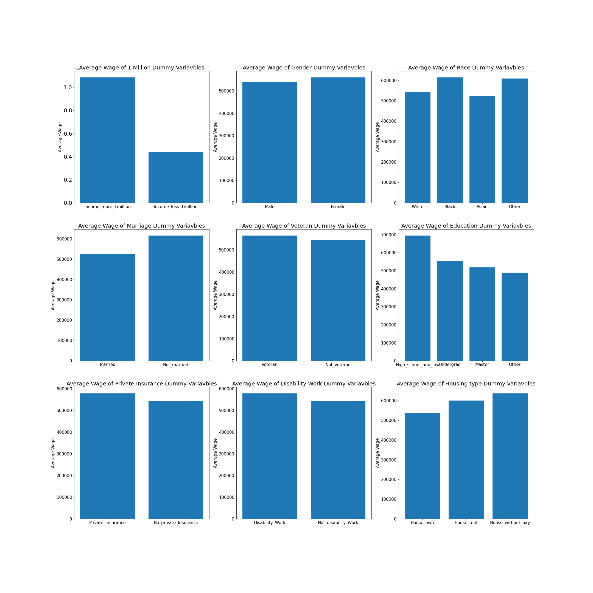
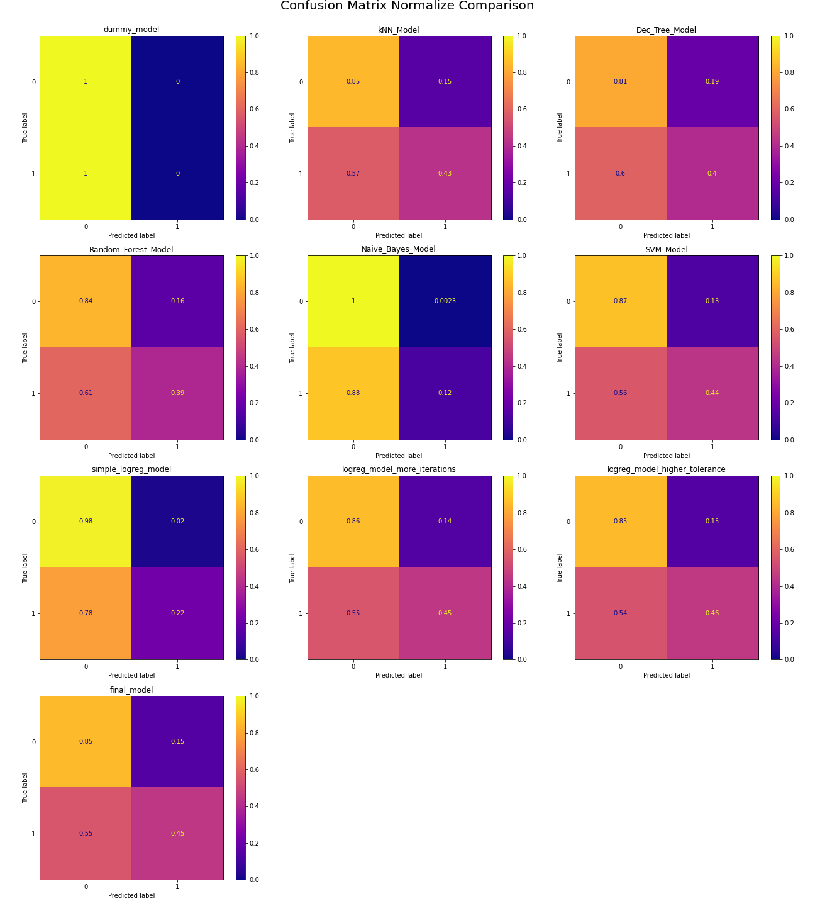

# Wage Prediction Model for JP Morgan
**Authors**: [Ji Hoon Chung](mailto:jhj1650@gmail.com), [Kibae Kim](mailto:rlqo7376@gmail.com)

## Overview
Using the customized data pulled out from CPS.IMPUMS.ORG, we retrieved various demographics data:
    *housing status
    *State
    *age
    *sex
    *race
    *marital status
    *veteran status
    *number of child
    *education level
    *occupation
    *Job Industry
    *Disabillity status
    *Health insurance status 
***
Using these varaibles, our goal is to build up a machine learning model that can successfully predict whether a person's salary will be higher than $1M or not.

## Business Problem
***
Our client, JP Morgan Chase, is trying to attract more wealthy investers for their newly improvised cryptocurrency fund. JP Morgan gave us access to their demographics survey data which performed against general public. Although survey data seems to have very little relationship to the income of a personnel, we would have to build an accurate model to filter out individuals making salary higher than $1M so JP Morgan can appropriately send out invitations to join their cryptocurrency fund.
[Link for more information](https://www.marketwatch.com/story/jpmorgan-to-offer-wealthy-clients-access-to-bitcoin-fund-report-11619460709)

##  Basic Data Structure
***
We have dummied most of our data to have final dataset of 23 independent varaibles, and their mean wage per dummy varialbe is shown as follows:


## Modeling
***
We've tried various models including Logistic Regression, kNearest Neighbors, Naive Bayes, Support Vector Machine, Random Forest, and Decision tree. Each model has its unique feature, but we ended up choosing Naive Bayes as the Optimal model for our needs.
For their general scoring overview, please refer to below image.


## Conclusion
***
Although simple log_reg model seems to be the best model overall, we felt like our model should be optimized in maintaining false positive rate as JP Morgan has strict minimum salary criteria for their investors. This way, we can prevent from sending invitations to people who are unable to join as low as possible.

Naive Bayes model is selected to be our best model which has the lowest false positive rate by far.
Even though True Positive rate for Naive Bayes model is quite disappointing, this is not much of a concern as there will be limited number of invitations anyways.

## Ideas for Improvement
***
1. Find other effective independent variables that can enhance accruacy of our model.
2. Find different method of data cleaning.
3. Find the way to improve precision from our final model.

## Repository Structure

***

```
├── README.md                           <- The high-level overview of this project
├── Wage_Predict.pdf.pdf               <- PDF version of project presentation
├── Wage_Predict_Project.ipynb          <- Final_Notebook used for the project
├── images                              <- Sourced externally and visualizations generated from code
├── data                                <- All the .csv data files used for the notebook.
```
